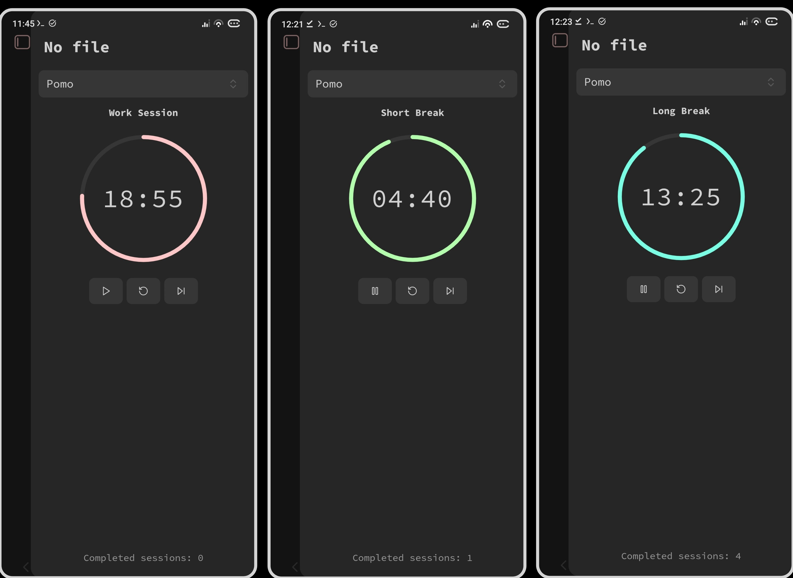

# Pomo Obsidian Plugin

A Pomodoro timer widget for Obsidian that lives in your sidebar.

## What is Pomo?

Pomo adds a clean, minimal Pomodoro clock widget to your Obsidian sidebar. It helps you stay focused and productive by breaking your work into manageable intervals.

## How it Works

Start a 25-minute work session, take a 5-minute break, repeat. After 4 work sessions, take a longer 15-minute break. Everything happens automatically — just focus on your work.

## Features

- **Auto-start on Load** — Open Obsidian, and the timer starts automatically. No need to click anything—just open your vault and you're already working.

- **Automatic Session Switching** — When your work session ends, Pomo switches you to a break. When the break's over, it's back to work. You don't have to think about it.

- **Customize Progress Bar Colors** — Choose different colors for work sessions, short breaks, and long breaks. Make the timer match your theme or just pick colors you like.

- **Customize Notification Messages** — Write your own notification text for each session type. Change "Work session complete" to whatever actually motivates you or makes you smile.

- **Flexible Session Durations** — Adjust how long your work sessions and breaks last. The default is 25/5/15 minutes, but you can change it to whatever works for you.

- **Sound Alerts** — A simple beep plays when each session ends, so you know it's time to switch without having to watch the timer.

- **Vibration Support** — Your device vibrates when a session completes (tested on Android). Useful when you're wearing headphones or have notifications muted.

---

## License

Pomo is released under the MIT License.  [MIT License](./LICENSE).

---
